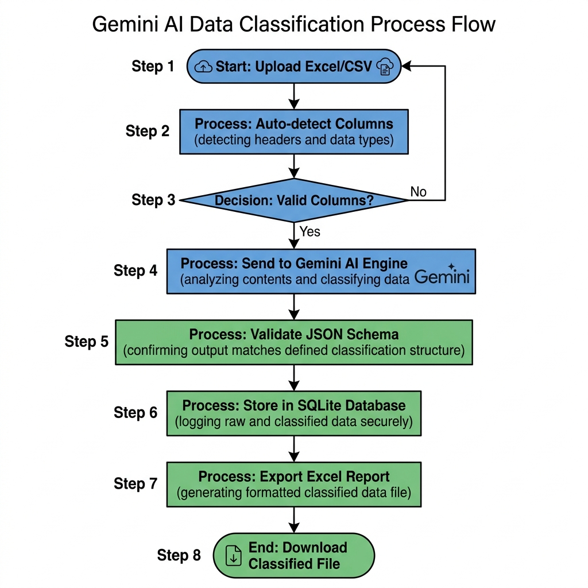
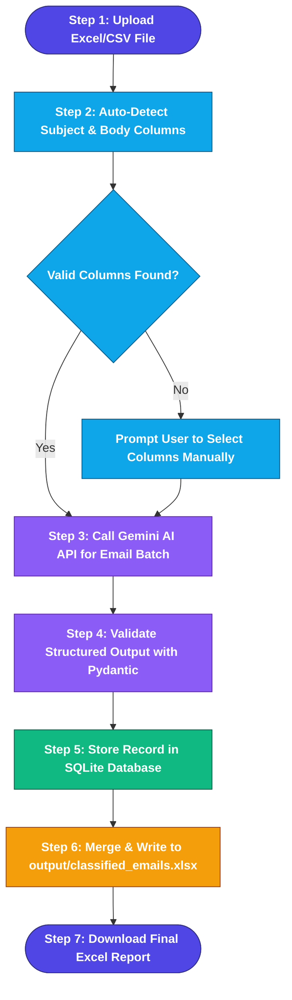

# 🗺️ AI Customer Email Classifier — Business Process Map Chart



---

## 📌 Standard Process Map Diagram

```text
  ┌────────────────────────┐
  │  1. START: Upload File │ (Excel .xlsx / .csv input)
  └───────────┬────────────┘
              │
              ▼
  ┌────────────────────────┐
  │ 2. Column Auto-Detect  │ (Identify Email ID, Subject, & Body)
  └───────────┬────────────┘
              │
              ▼
  ┌────────────────────────┐
  │  3. Gemini AI Analysis │ (Extract Category, Urgency, Sentiment,
  └───────────┬────────────┘  Summary & Suggested Reply via Pydantic)
              │
              ▼
  ┌────────────────────────┐
  │ 4. Database Storage    │ (Insert structured record into SQLite emails.db)
  └───────────┬────────────┘
              │
              ▼
  ┌────────────────────────┐
  │ 5. Excel Export        │ (Merge results & save to output/classified_emails.xlsx)
  └───────────┬────────────┘
              │
              ▼
  ┌────────────────────────┐
  │  6. END: Download File │ (Interactive Streamlit Dashboard download)
  └────────────────────────┘
```

---

## 🔄 Detailed Flowchart Diagram


