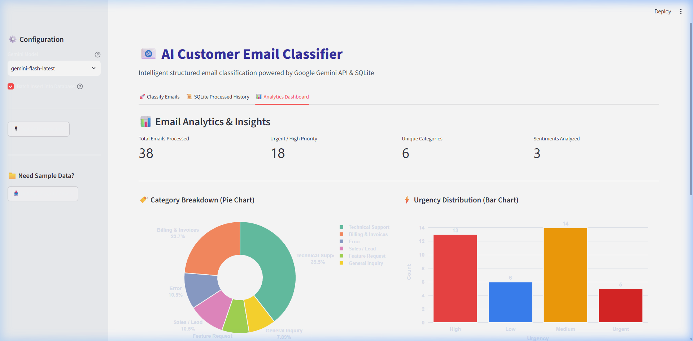
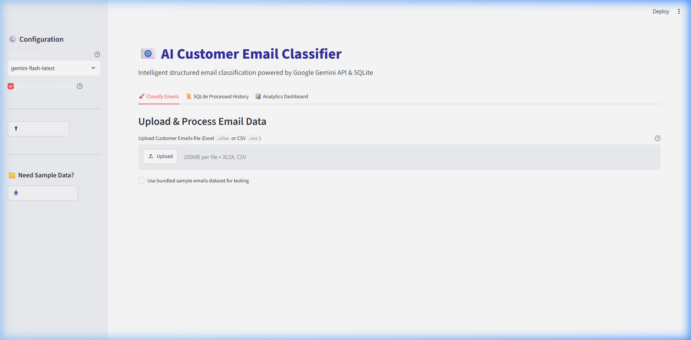
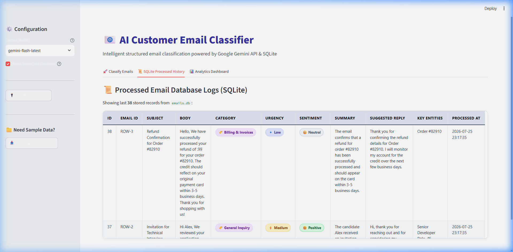

# 📧 AI Customer Email Classifier & Analytics Engine

An end-to-end AI-powered email classification system built with **Python**, **Streamlit**, **Google Gemini 2.5/1.5 Flash API**, **Pydantic**, and **SQLite**.

The system ingests customer support emails (from Excel `.xlsx` or `.csv` files), automatically analyzes their content using Gemini AI models, extracts structured metadata (Category, Urgency, Sentiment, Key Entities, Executive Summary, and Suggested Auto-Reply), persists records in an SQLite database, and exports structured reports back to Excel.

---

## 🖼️ Application Interface Preview

### 📊 1. Analytics & Insights Dashboard


---

### 🚀 2. Classify Emails Interface


---

### 📜 3. SQLite Processed History Logs


---

## 🌟 Key Features

- ⚡ **AI-Powered Email Classification**: Powered by Google Gemini (`gemini-2.5-flash`, `gemini-1.5-flash`, `gemini-1.5-pro`) with fallback and retry logic.
- 🎯 **Structured JSON Output**: Uses `Pydantic` schema enforcement for 100% reliable schema parsing.
- 📊 **Interactive Streamlit Dashboard**: User-friendly UI with progress indicators, metric cards, and JSON insights.
- 💾 **SQLite Database Persistence**: Stores classification history with deduplication and analytics querying.
- 📥 **Flexible File Processing**: Auto-detects Subject, Body, and Email ID columns in `.xlsx` and `.csv` files.
- 📤 **Automated Excel Export**: Merges classification results back into Excel spreadsheets saved to `output/`.

---

## 📂 Project Structure

```text
Email Classifier/
├── app.py              # Streamlit Web UI Dashboard
├── api.py              # Gemini AI API Integration & Pydantic Schema
├── assets/             # Media assets & UI screenshots
│   └── screenshots/
│       ├── analytics_dashboard.png     # Analytics Dashboard Screenshot
│       ├── classify_emails.png         # Classify Emails Interface Screenshot
│       ├── sqlite_history.png          # SQLite Database History Logs Screenshot
│       ├── email_upload_preview.png    # Upload & Data Preview Screenshot
│       ├── classification_progress.png # Real-time Processing Progress Screenshot
│       └── classification_results.png  # Structured Output Results Table Screenshot
├── database.py         # SQLite Database Manager (emails.db)
├── excel.py            # Excel & CSV Ingestion / Export Handler
├── config.py           # Application Settings & Path Definitions
├── prompts.py          # Gemini AI System & Task Prompts
├── utils.py            # Helper Functions & Column Detection Logic
├── logger.py           # Application Logging System
├── PROCESS_MAP.md      # System Architecture & Flowchart Documentation
├── requirements.txt    # Python Dependencies
├── .env.example        # Environment Variable Template
├── data/               # SQLite Database (emails.db) & Input Datasets
└── output/             # Exported Classified Excel Spreadsheets
```

---

## 🚀 Quick Start & Installation

### 1. Prerequisites
- **Python 3.10+** installed on your system.
- A **Google Gemini API Key** (get one free at [Google AI Studio](https://aistudio.google.com/)).

### 2. Virtual Environment Setup
Ensure your virtual environment is created and activated:
```powershell
# Windows PowerShell
python -m venv .venv
.\.venv\Scripts\Activate.ps1
```

### 3. Install Dependencies
```powershell
pip install -r requirements.txt
```

### 4. Configure API Key
Create a `.env` file in the project root folder (or copy `.env.example`):
```env
GEMINI_API_KEY=your_actual_gemini_api_key_here
```

---

## 🖥️ Running the Application

Launch the Streamlit Web Application using:
```powershell
streamlit run app.py
```

The web dashboard will open automatically in your browser at `http://localhost:8501`.

---

## 📥 Usage Guide

1. **Select / Upload Data**: Use the sample dataset provided or upload your custom `.xlsx` or `.csv` file.
2. **Column Mapping**: Confirm or select the columns representing **Email ID**, **Subject**, and **Body**.
3. **Choose AI Model**: Select between `gemini-2.5-flash` (recommended for speed) or `gemini-1.5-flash` / `gemini-1.5-pro`.
4. **Run Classification**: Click **✨ Run Classification Engine** to process emails in real time.
5. **View & Export**: Review results in the interactive table, inspect SQLite history/analytics, and download the output Excel file from `output/classified_emails.xlsx`.
